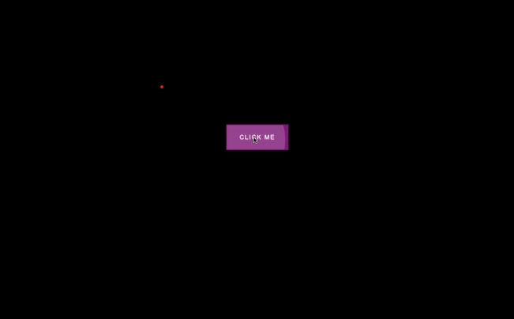

# 🚀 Code Everyday Challenge - DAY 20: Button Ripple Effect

## Description
In this project, we're going to create a button ripple effect. Basically, we will be able to have buttons and just give them a specific class of "ripple." When we do that, if we click on those buttons, we'll get this effect.
