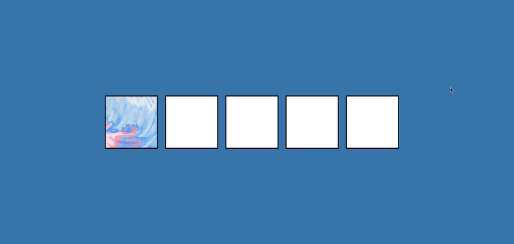

# 🚀 Code Everyday Challenge - DAY 21: Drag And Drop

## Description
In this project,  I want to get into a little bit of drag and drop functionality, so we're going to just create these boxes style, these boxes. We're going to have one div inside one of these boxes that has a background image.And you see, if I grab it, a couple of things happen.

