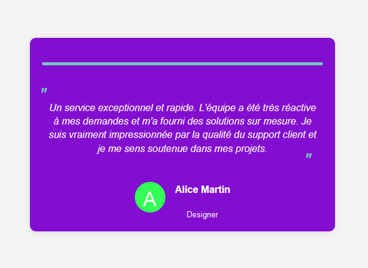

# 🚀 Code Everyday Challenge  - DAY 47 : Testimonial Switch

## Description

This project is a simple web application that displays customer testimonials in a carousel format. Each testimonial is presented with a stylized quote, an image of the author, their name and profession. The application uses HTML, CSS and JavaScript to create a dynamic and attractive user interface.

## Features

- Display testimonials with detailed messages.
- Automatic carousel that changes testimonials after a certain time.
- Modern styles with stylized quotes around testimonials.
- Responsiveness and compatibility with modern browsers.

## Technologies Utilisées

- HTML
- CSS
- JavaScript
